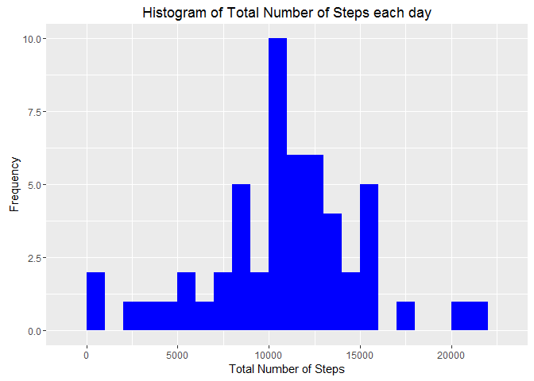

Introduction
============

This assignment makes use of data from a personal activity monitoring
device. This device collects data at 5 minute intervals through out the
day. The data consists of two months of data from an anonymous
individual collected during the months of October and November, 2012 and
include the number of steps taken in 5 minute intervals each day.

This project investigates certain variables within the data to extract
high level patterns. It is the output of Assignment 1 for Reproducible
Reaserch Course offered by Coursera. It is done in a Markdown Document
that can be processed by knitr and be transformed into an HTML file.

Install Needed R Packages
=========================

    library(knitr)
    opts_chunk$set(echo = TRUE)  # allows readability of code

    library(lubridate)  # needed for handling dates
    library(dplyr) # needed for manipulating & summarizing data
    library(ggplot2) # needed for plotting graphs

Loading and preprocessing the data
==================================

Show any code that is needed to

1.  Load the data (i.e. read.csv())
2.  Process/transform the data (if necessary) into a format suitable for
    your

Read Data and Process
---------------------

Set working Directory, read in data and convert variables to needed
format.

    setwd("C://Users//Devayne//Desktop//Data Specialization Course//Reproducible Research//Assignment 1")
    data <- read.csv("activity.csv", header= TRUE, sep = ",", na.strings = "NA") 
    data$date <- ymd(data$date)   ## transform the data variable to a date format

Get a feel for sturcture of data

    head(data)

    ##   steps       date interval
    ## 1    NA 2012-10-01        0
    ## 2    NA 2012-10-01        5
    ## 3    NA 2012-10-01       10
    ## 4    NA 2012-10-01       15
    ## 5    NA 2012-10-01       20
    ## 6    NA 2012-10-01       25

    str(data)

    ## 'data.frame':    17568 obs. of  3 variables:
    ##  $ steps   : int  NA NA NA NA NA NA NA NA NA NA ...
    ##  $ date    : POSIXct, format: "2012-10-01" "2012-10-01" ...
    ##  $ interval: int  0 5 10 15 20 25 30 35 40 45 ...

What is mean total number of steps taken per day?
-------------------------------------------------

For this part of the assignment, you can ignore the missing values in
the dataset.

1.  Calculate the total number of steps taken per day.
2.  Make a histogram of the total number of steps taken each day.
3.  Calculate and report the mean and median of the total number of
    steps taken per day.

### Answer

1.  Calculate total number of steps per day by aggregating by date
    and summing.

<!-- -->

    totalsteps <- aggregate(steps ~ date, subset(data, steps != "NA") , sum)
    totalsteps

    ##          date steps
    ## 1  2012-10-02   126
    ## 2  2012-10-03 11352
    ## 3  2012-10-04 12116
    ## 4  2012-10-05 13294
    ## 5  2012-10-06 15420
    ## 6  2012-10-07 11015
    ## 7  2012-10-09 12811
    ## 8  2012-10-10  9900
    ## 9  2012-10-11 10304
    ## 10 2012-10-12 17382
    ## 11 2012-10-13 12426
    ## 12 2012-10-14 15098
    ## 13 2012-10-15 10139
    ## 14 2012-10-16 15084
    ## 15 2012-10-17 13452
    ## 16 2012-10-18 10056
    ## 17 2012-10-19 11829
    ## 18 2012-10-20 10395
    ## 19 2012-10-21  8821
    ## 20 2012-10-22 13460
    ## 21 2012-10-23  8918
    ## 22 2012-10-24  8355
    ## 23 2012-10-25  2492
    ## 24 2012-10-26  6778
    ## 25 2012-10-27 10119
    ## 26 2012-10-28 11458
    ## 27 2012-10-29  5018
    ## 28 2012-10-30  9819
    ## 29 2012-10-31 15414
    ## 30 2012-11-02 10600
    ## 31 2012-11-03 10571
    ## 32 2012-11-05 10439
    ## 33 2012-11-06  8334
    ## 34 2012-11-07 12883
    ## 35 2012-11-08  3219
    ## 36 2012-11-11 12608
    ## 37 2012-11-12 10765
    ## 38 2012-11-13  7336
    ## 39 2012-11-15    41
    ## 40 2012-11-16  5441
    ## 41 2012-11-17 14339
    ## 42 2012-11-18 15110
    ## 43 2012-11-19  8841
    ## 44 2012-11-20  4472
    ## 45 2012-11-21 12787
    ## 46 2012-11-22 20427
    ## 47 2012-11-23 21194
    ## 48 2012-11-24 14478
    ## 49 2012-11-25 11834
    ## 50 2012-11-26 11162
    ## 51 2012-11-27 13646
    ## 52 2012-11-28 10183
    ## 53 2012-11-29  7047

1.  Make Histogram using ggplot2 package.

<!-- -->

    ggplot(totalsteps, aes(x = steps)) + geom_histogram(fill = "blue", binwidth = 1000) +
    labs(title = "Histogram of Total Number of Steps each day", x = "Total Number of Steps", y = "Frequency")

<!-- -->

1.  Calculate and report the mean and median of the total number of
    steps taken per day.

<!-- -->

    meanSteps <- mean(totalsteps$steps, na.rm = TRUE)
    medianSteps <- median(totalsteps$steps, na.rm = TRUE)
    meanSteps

    ## [1] 10766.19

    medianSteps

    ## [1] 10765

The mean steps per day is 10766 and median steps is 10765.

What is the average daily activity pattern?
-------------------------------------------

1.  Make a time series plot (i.e. type = "l") of the 5-minute
    interval (x-axis) and the average number of steps taken, averaged
    across all days (y-axis)
2.  Which 5-minute interval, on average across all the days in the
    dataset, contains the maximum number of steps?

### Answer

1.  Calculate the average number of steps by interval (NA's are removed)
    the plot timeseries.

<!-- -->

    intervalsteps <- aggregate(steps ~ interval, subset(data, steps != "NA") , mean)

    ggplot(intervalsteps, aes(x=interval, y=steps)) + geom_line(color = "blue")

<!-- -->

1.  Maximum number of steps across intervals; I use the whihc.max
    function to retrieve.

<!-- -->

    intervalsteps[which.max(intervalsteps$steps),]

    ##     interval    steps
    ## 104      835 206.1698

The maximum of average number of steps is 206 which occurs on interval
835

Imputing missing values
-----------------------

1.  Calculate and report the total number of missing values in the
    dataset (i.e. the total number of rows with NAs)
2.  Devise a strategy for filling in all of the missing values in
    the dataset. The strategy does not need to be sophisticated. For
    example, you could use the mean/median for that day, or the mean for
    that 5-minute interval, etc.
3.  Create a new dataset that is equal to the original dataset but with
    the missing data filled in. Make a histogram of the total number of
    steps taken each day and Calculate and report the mean and median
    total number of steps taken per day. Do these values differ from the
    estimates from the first part of the assignment? What is the impact
    of imputing missing data on the estimates of the total daily number
    of steps?

### Answer

1.  Get count of missing values

<!-- -->

    sum(is.na(data$steps))

    ## [1] 2304

There ar 2304 missing values

1.  Replace missing values with average steps from 5 min interval in
    which the NA occurs

<!-- -->

    data_nonulls <- data
    nulls <- is.na(data_nonulls$steps)
    #we cannot use intervalsteps above because it does not contain date; So aggregate mean steps by interval again using tapply function
    data_avg_interval <- tapply(data_nonulls$steps, data_nonulls$interval, mean, na.rm=TRUE, simplify=TRUE)
    ## replace null values
    data_nonulls$steps[nulls] <- data_avg_interval[as.character(data_nonulls$interval[nulls])]
    sum(is.na(data_nonulls$steps))

    ## [1] 0

Final output from code above indicates there are no longer missing
values

1.  Histogram

<!-- -->

    totalsteps_nonulls <- aggregate(steps ~ date, data_nonulls , sum)

    ggplot(totalsteps_nonulls, aes(x = steps)) + geom_histogram(fill = "blue", binwidth = 1000) +
      labs(title = "Histogram of Total Number of Steps each day, Missing Values Replaced", x = "Total Number of Steps", y = "Frequency") 

<!-- -->

Find the mean & median

    meanSteps_nonulls <- mean(totalsteps_nonulls$steps, na.rm = TRUE)
    medianSteps_nonulls <- median(totalsteps_nonulls$steps, na.rm = TRUE)
    meanSteps_nonulls

    ## [1] 10766.19

    medianSteps_nonulls

    ## [1] 10766.19

The mean and median value are now both the same. the median is now
slightly higher than the original median.

Are there differences in activity patterns between weekdays and weekends?
-------------------------------------------------------------------------

1.  Create a new factor variable in the dataset with two levels -
    "weekday" and "weekend" indicating whether a given date is a weekday
    or weekend day.
2.  Make a panel plot containing a time series plot (i.e. type = "l") of
    the 5-minute interval (x-axis) and the average number of steps
    taken, averaged across all weekday days or weekend days (y-axis).

### Answer

1.  Use weekdays function and mutate from dplyr package to create new
    variable daytype

<!-- -->

    totaldata <- mutate(data_nonulls, daytype = ifelse(weekdays(data_nonulls$date) == "Saturday" |                              weekdays(data_nonulls$date) == "Sunday", "weekend", "weekday"))
    totaldata$daytype <- as.factor(totaldata$daytype) # convert to a factor variable
    head(totaldata)

    ##       steps       date interval daytype
    ## 1 1.7169811 2012-10-01        0 weekday
    ## 2 0.3396226 2012-10-01        5 weekday
    ## 3 0.1320755 2012-10-01       10 weekday
    ## 4 0.1509434 2012-10-01       15 weekday
    ## 5 0.0754717 2012-10-01       20 weekday
    ## 6 2.0943396 2012-10-01       25 weekday

1.  Use dplyr package to get average steps for every 5 minute interval
    within weekdays or weekends. Then plot timeseries to compare
    weekdays & weekends.

<!-- -->

    interval_data <- totaldata %>%
      group_by(interval, daytype) %>%
      summarize(steps = mean(steps))

    s <- ggplot(interval_data, aes(x=interval, y=steps, color = daytype)) +
         geom_line() + facet_wrap(~ daytype, ncol = 1, nrow=2) 
    print(s)

<!-- -->
On average people tend to take more steps on weekends than weekdays.
